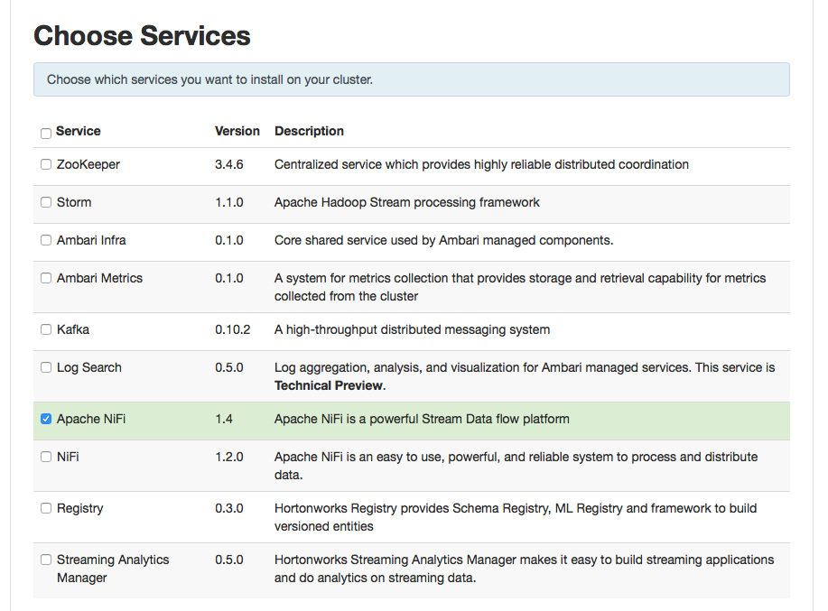
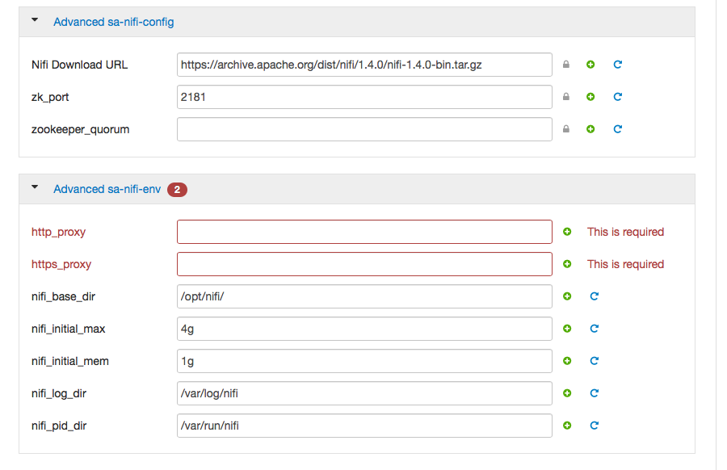

# bcr-ambari-stack

Custom Ambari stack for BigData Services. This repo includes some of the custom service made for ambari services. This is not supported by Hortonworks.

# Prerequisit

You need to have Ambari server installed. This package works with both HDF and HDP. You should have access to the ambari server linux box.

# Supported Platform

1. CentOS/RHEL 7
2. Ambari 2.x
3. HDP/HDF 2.x/3.x

# Installation Example for HDF 3.0

Installing HDF 3.0 if you dont have it already. Only use --purge if you want to remove all other mpacks.

```
wget https://s3.amazonaws.com/public-repo-1.hortonworks.com/HDF/centos7/3.x/updates/3.0.2.0/tars/hdf_ambari_mp/hdf-ambari-mpack-3.0.2.0-76.tar.gz /tmp
ambari-server install-mpack --mpack=/tmp/hdf-ambari-mpack-3.0.2.0-76.tar.gz  --verbose

```

```
cd /var/lib/ambari-server/resources/
git clone https://github.com/becloudready/bcr-ambari-stack.git

ln -s /var/lib/ambari-server/resources/bcr-ambari-stack/ambari-nifi /var/lib/ambari-server/resources/stacks/HDF/3.0/services/NIFI1.4

ambari-server restart

```
# Installation Example for HDP

Check what version of HDF or HDP is intalled in your system. Example of installing on HDP

```
VERSION=`hdp-select status hadoop-client | sed 's/hadoop-client - \([0-9]\.[0-9]\).*/\1/'`
sudo ln -s /var/lib/ambari-server/resources/ambari-nifi /var/lib/ambari-server/resources/stacks/HDP/$VERSION/services/APACHENIFI

ambari-server restart
```

# Service Selection for NiFi 1.4

Once you restart the Ambari, the new Apache NiFi will show up in Ambari service selection screen like this



Proxy selection for NiFi 1.4 you need to provide the proxy servers, if you are behind firewall. Very handy for corporate environment with heavy firewalling.



Please put no_proxy, if you don't have any proxy otherwise it wont work.


# Issues

1. NiFi Package is bit big, so if you have slow internet connection give it time to download at installation phase.

Please raise issue with full logs and step to reproduce.

# More Info

https://www.becloudready.com

To install Elasticserch

https://www.becloudready.com/forum/articles-1/writing-custom-ambari-service-for-hadoop-hdp-or-hdf-cluster

